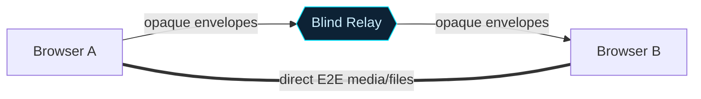
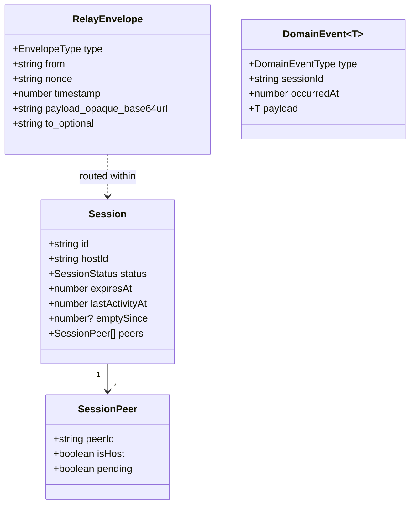

# Quantum Bunker — Design Document

> **Status:** Living document · **Audience:** engineers, reviewers, security auditors
> **Companion diagrams:** [`docs/diagrams/workflows.md`](diagrams/workflows.md) ·
> [`docs/diagrams/architecture.md`](diagrams/architecture.md)
>
> This document is the single narrative reference for *what* Quantum Bunker is, *why* it is built the
> way it is, and *how* the pieces fit. Implementation detail lives in code and the focused docs under
> `docs/`; this document gives the through-line and links out.

---

## 1. Summary

Quantum Bunker is a **zero-knowledge, ephemeral, real-time messaging vault**. The server is a *blind
relay*: it routes opaque base64url envelopes between peers and never decrypts, logs, or stores
message payloads. Sessions live only in memory and auto-expire. All cryptographic meaning is handled
by the clients; the server only coordinates sessions and forwards bytes.

It is a single-port, full-stack TypeScript monorepo — React 19 frontend, Express + `ws` backend,
shared domain contracts — served by one Node process.

---

## 2. Goals & non-goals

### Goals
- **Zero server knowledge** of message content — by construction, not by policy.
- **Ephemerality** — no database; server restart wipes all state; messages auto-disappear client-side.
- **End-to-end encryption** for messages, files, and media (double-ratchet; DTLS-SRTP for calls).
- **Traffic-analysis resistance** — fixed-bucket plaintext padding + timing jitter on non-interactive frames.
- **Strong identity & MITM detection** — long-term Ed25519 keys, safety numbers, key-change alerts.
- **Resilience under abuse** — rate limits, payload caps, backpressure, replay defense, graceful degradation.
- **Architectural clarity** — hexagonal backend, hook-driven frontend, one frozen wire contract.

### Non-goals
- **No persistence** (Redis/DB/file). Ephemerality is the feature.
- **No accounts / OAuth / JWT.** The host recovery token *is* the auth mechanism.
- **No group calls.** Voice/video is 1-on-1 only by design.
- **No relay fallback for media.** A failed direct channel is surfaced, never silently rerouted.
- **No server-side padding.** Padding is client-only.

---

## 3. Architecture overview

### 3.1 Backend — Hexagonal (Ports & Adapters)

Dependencies flow strictly inward: `core → application → adapters → entrypoints`. Use cases own all
policy (rate limits, TTL, peer limits) and depend only on port interfaces. Adapters implement ports.
`container.ts` is the only place adapters are constructed.

See [architecture.md §3–4](diagrams/architecture.md#3-hexagonal-backend-ports--adapters).

### 3.2 Frontend — hook-driven

Components are declarative; custom hooks own every side effect and all state. No global state library.
`useRelay` owns the WebSocket and dispatches `SIGNALING` to `useP2P` (data channels) and `useCall`
(media). See [architecture.md §6](diagrams/architecture.md#6-frontend-hook-tree).

### 3.3 Shared contract layer

`src/shared/contracts/v1/` is the single source of truth for all cross-boundary types and Zod
schemas. It is **frozen** (ADR-003): fields are add-only; breaking changes require `v2/`.

---

## 4. Domain invariants (never break these)

These map directly to `CLAUDE.md` and are enforced in code, not just convention:

1. **Zero-knowledge** — server never logs/inspects/stores `envelope.payload`; log metadata only.
2. **Frozen envelope contract** — add-only; removals/renames need `v2/`.
3. **Use cases own policy** — limits/TTL/peer caps live in use cases or `relay.policy.ts`, never adapters.
4. **Host authority** — only `isHost` peers accept/reject/kick/destroy; server-enforced.
5. **Nonce dedup is client-authoritative** — never strip/regenerate nonces server-side.
6. **Ephemeral state** — no DB; restart = clean slate.
7. **No relay fallback for P2P media** — `directFailed` surfaces to the UI.
8. **Calls are 1-on-1 only** — no call UI when `peers.length > 1`.
9. **Padding is client-only** — `PADDING.BUCKETS` in `constants.ts` is the source of truth, mirrored in `src/crypto/message-padding.ts`.

---

## 5. Core flows

Full sequence diagrams for each are in [`workflows.md`](diagrams/workflows.md). Summary:

| Flow | Path | Diagram |
|---|---|---|
| Session creation | REST create → WS host claim | [§2](diagrams/workflows.md#2-session-creation) |
| Join (approval) | pending → host accept | [§3](diagrams/workflows.md#3-join--standard-approval) |
| Join (whitelist) | membership token auto-admit | [§4](diagrams/workflows.md#4-join--stateless-whitelist-auto-admit) |
| Auth precedence | host → peer → membership → pending | [§6](diagrams/workflows.md#6-authentication-precedence-on-join) |
| Reconnect | peerToken within 30s grace | [§7](diagrams/workflows.md#7-reconnect-after-refresh) |
| Messaging | relay fan-out + ACK + READ | [§8](diagrams/workflows.md#8-messaging--relay-ack-read-receipt) |
| Edit / delete | author-bound, client-applied | [§9](diagrams/workflows.md#9-edit--delete) |
| P2P setup | SIGNALING → data channel | [§11](diagrams/workflows.md#11-p2p-connection-setup-webrtc) |
| File (relay ≤ 5 MB) | FILE envelope | [§12](diagrams/workflows.md#12-file-transfer--relay-path--5-mb) |
| File (P2P ≤ 256 MB) | chunked data channel | [§13](diagrams/workflows.md#13-file-transfer--p2p-path--256-mb) |
| Call | DTLS-SRTP, 1-on-1 | [§14](diagrams/workflows.md#14-voice--video-call-1-on-1) |
| Mutual whitelist | in-chat key pinning | [§15](diagrams/workflows.md#15-in-chat-mutual-whitelist) |
| Verification | safety number + key-change alert | [§16](diagrams/workflows.md#16-contact-verification--key-change-alert) |
| Destruction | host DELETE + auto-cleanup | [§17](diagrams/workflows.md#17-session-destruction--auto-cleanup) |

---

## 6. Data model

`EnvelopeType`: `PLAINTEXT` (refused), `NOISE_MESSAGE`, `SIGNALING`, `PING`/`PONG`, `ACK`, `READ`,
`EDIT`, `DELETE`, `FILE`. Full schemas in `shared/contracts/v1/`; protocol detail in
[`docs/events.md`](events.md).

---

## 7. Security design

| Concern | Mechanism |
|---|---|
| Confidentiality | Client-side double-ratchet E2E; server sees only ciphertext |
| Media confidentiality | DTLS-SRTP (calls); double-ratchet over DTLS (data channels) |
| MITM detection | Noise-derived safety numbers; full-screen key-change alert blocks messaging |
| Replay | Server nonce cache (`NONCE_CACHE_MAX` 50k) + 60s timestamp drift window; client nonce dedup |
| Traffic analysis | Fixed plaintext buckets (8 KB / 64 KB / 512 KB / 4 MB) + 0–120 ms jitter on non-interactive frames |
| Abuse / DoS | 10 msg/s/peer, 20 frames/s/socket, 50 conn/IP/min, payload & file caps, per-socket backpressure cutoff |
| Auth | Host recovery token (UUID) + per-session peer token; no accounts |
| Whitelist | Ed25519-signed stateless membership tokens; in-chat mutual key pinning |
| Privacy UI | Window-blur blackout (always on in chat), blur-to-reveal messages, decay countdown |

Threat-model depth and rationale: [`docs/security.md`](security.md). Rejection pipeline:
[workflows §10](diagrams/workflows.md#10-envelope-rejection--rate-limiting).

---

## 8. Limits

All numeric limits live in `src/backend/core/constants.ts` — never inline. Highlights:

| Constant | Value |
|---|---|
| `SESSION_LIMITS.MAX_PEERS` | 10 |
| `SESSION_LIMITS.DEFAULT_TTL_MS` / `MAX_TTL_MS` | 15 min / 24 hr |
| `SESSION_LIMITS.RECONNECT_GRACE_MS` | 30 s |
| `SESSION_LIMITS.INACTIVITY_TTL_MS` / `EMPTY_SESSION_TTL_MS` | 30 min / 5 min |
| `SESSION_LIMITS.MAX_ACTIVE_SESSIONS` | 10,000 |
| `RELAY_LIMITS.MAX_PAYLOAD_BYTES` | 16 MB |
| `RELAY_LIMITS.MAX_FILE_BYTES` / `MAX_P2P_FILE_BYTES` | 5 MB / 256 MB |
| `RELAY_LIMITS.FILE_CHUNK_BYTES` | 64 KB |
| `RELAY_LIMITS.MSG_PER_SECOND_LIMIT` / `SOCKET_MSG_PER_SECOND_LIMIT` | 10 / 20 |
| `RELAY_LIMITS.CONN_PER_IP_LIMIT` / `CONN_WINDOW_MS` | 50 / 60 s |
| `PADDING.BUCKETS` | 8 KB / 64 KB / 512 KB / 4 MB |
| `CLEANUP_INTERVAL_MS` | 60 s |

Complete table in [`CLAUDE.md`](../CLAUDE.md#limits-reference-srcbackendcoreconstantsts).

---

## 9. Technology choices & rationale

| Choice | Why |
|---|---|
| In-memory store, no DB | Ephemerality is a security property — nothing to subpoena, leak, or restore |
| Hexagonal backend | Use cases unit-testable with mock ports; adapters swappable; policy isolated from I/O |
| Frozen `v1/` contract | Wire stability across client/server deploys; breaking change forces explicit `v2/` |
| Hook-driven frontend | Side effects isolated; declarative components; no global state coupling |
| WebRTC for media/large files | Removes relay from the bandwidth path; preserves zero-knowledge under load |
| Double-ratchet *over* DTLS | Defense-in-depth; DTLS alone is not trusted as the only layer |
| Ed25519 + PBKDF2 | Fast signatures for identity/membership; passphrase-hardened key storage |
| Typed domain events | Observability without coupling use cases to loggers; payload never logged |

Decisions of record: ADR-001…006 in [`docs/adr/`](adr/), indexed in
[architecture.md](architecture.md#adr-index).

---

## 10. Testing strategy

Layered, mirroring the architecture (`tests/`): `unit` (use cases/schemas, mock ports), `integration`
(real in-memory store + Express + ws), `e2e` (two-peer relay flow), `smoke`, `load`, `stress`. There
is no database to mock — the real in-memory store is used. Run `npm test`; lint with `npm run lint`
(`tsc --noEmit`). Details: [`docs/test-strategy.md`](test-strategy.md).

---

## 11. Extension playbook

When adding a feature, follow the decision tree (`CLAUDE.md`):

1. Changes the wire protocol? → `shared/contracts/v1/` first (or `v2/` if breaking) + ADR.
2. Adds a numeric limit? → `constants.ts` only.
3. Adds business logic? → new use case (never modify an existing one — ADR-006).
4. Needs new I/O? → new adapter, wired only in `container.ts`.
5. New WS message type? → update `ws.transport.ts` **and** `useRelay.ts` **and** `docs/events.md`.
6. Adds UI? → new hook/component, zero business logic in components.
7. Tests + doc update.

---

## 12. Document map

| Topic | File |
|---|---|
| Project guide / invariants / limits | [`CLAUDE.md`](../CLAUDE.md) |
| **Workflow diagrams (all cases)** | [`docs/diagrams/workflows.md`](diagrams/workflows.md) |
| **Architecture diagrams** | [`docs/diagrams/architecture.md`](diagrams/architecture.md) |
| Architecture narrative | [`docs/architecture.md`](architecture.md) |
| Core flows (ASCII) | [`docs/flows.md`](flows.md) |
| Events & protocol | [`docs/events.md`](events.md) |
| Backend internals | [`docs/backend.md`](backend.md) |
| Frontend internals | [`docs/frontend.md`](frontend.md) |
| Security model | [`docs/security.md`](security.md) |
| Product framing | [`docs/product.md`](product.md) |
| Test strategy | [`docs/test-strategy.md`](test-strategy.md) |
| ADRs | [`docs/adr/`](adr/) |
| Feature usage guides | [`usage/`](../usage/) |
