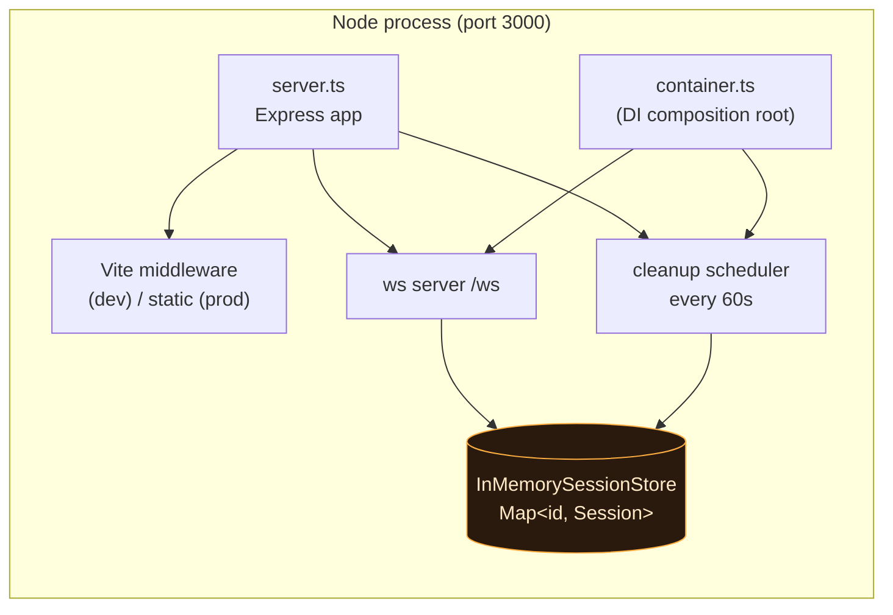
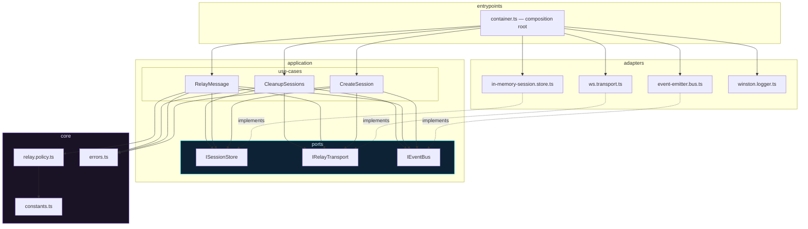
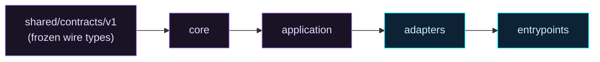
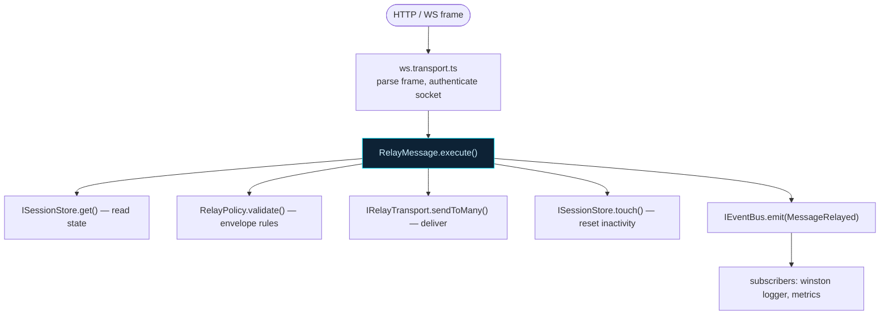
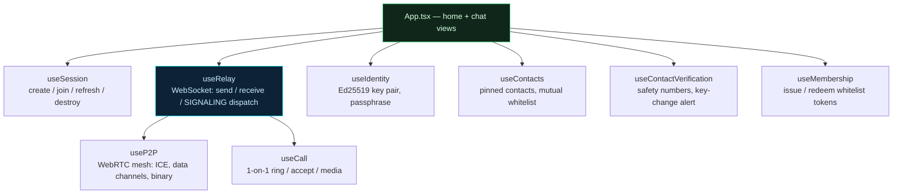
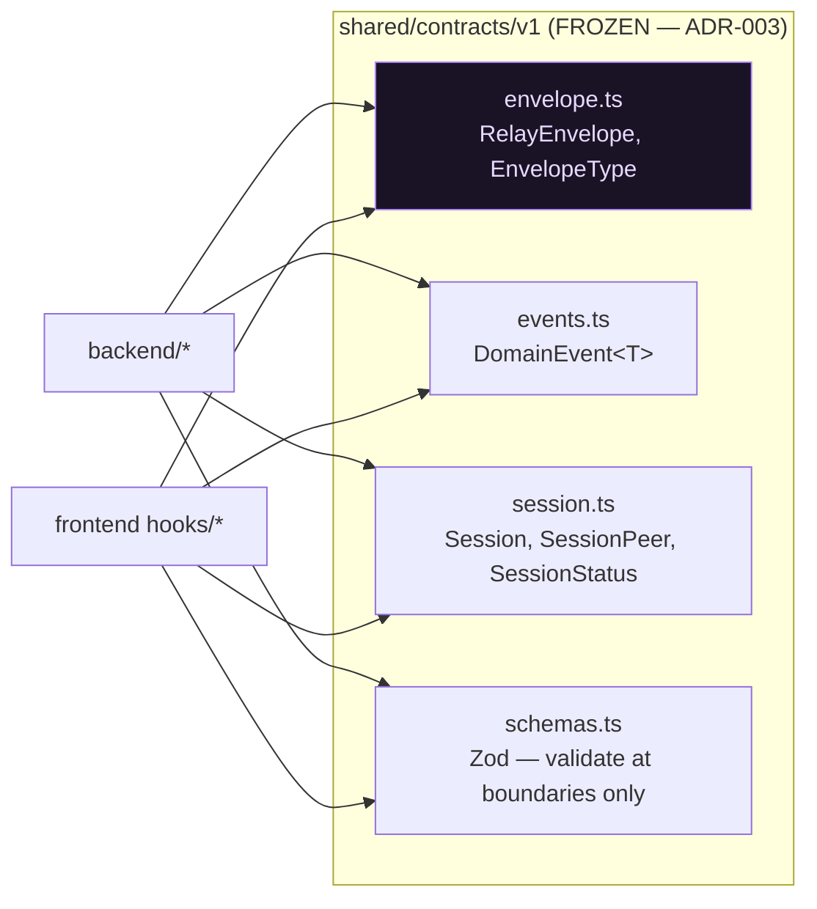
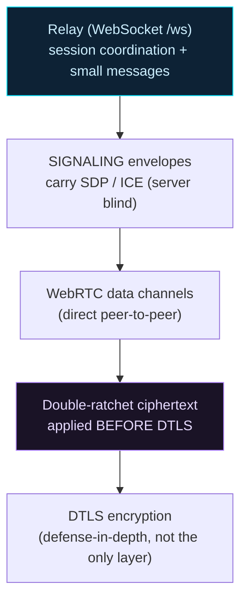
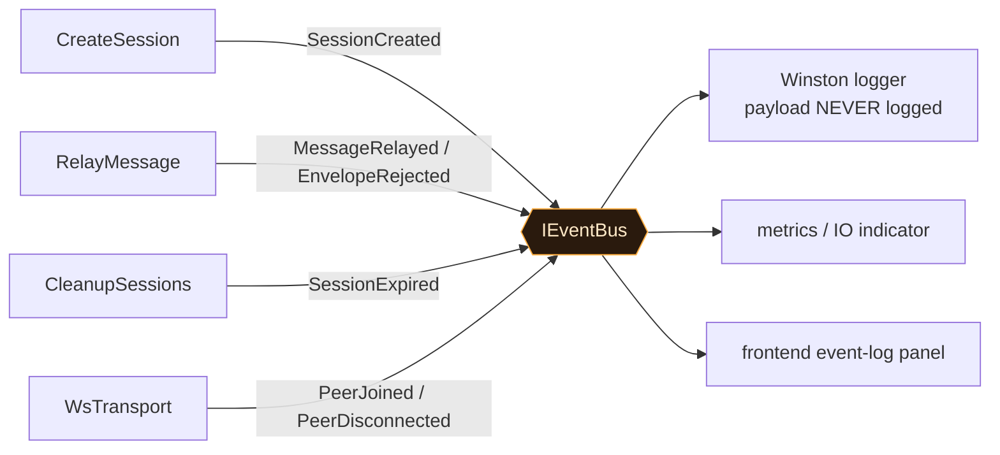
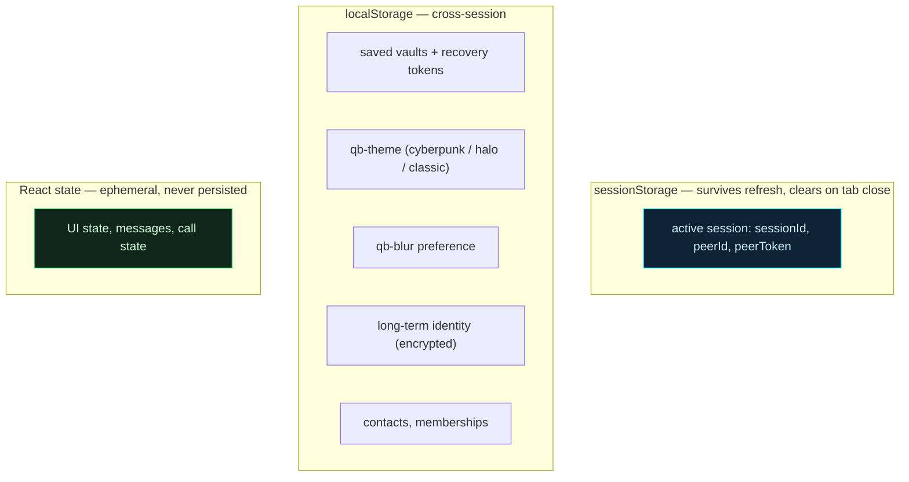
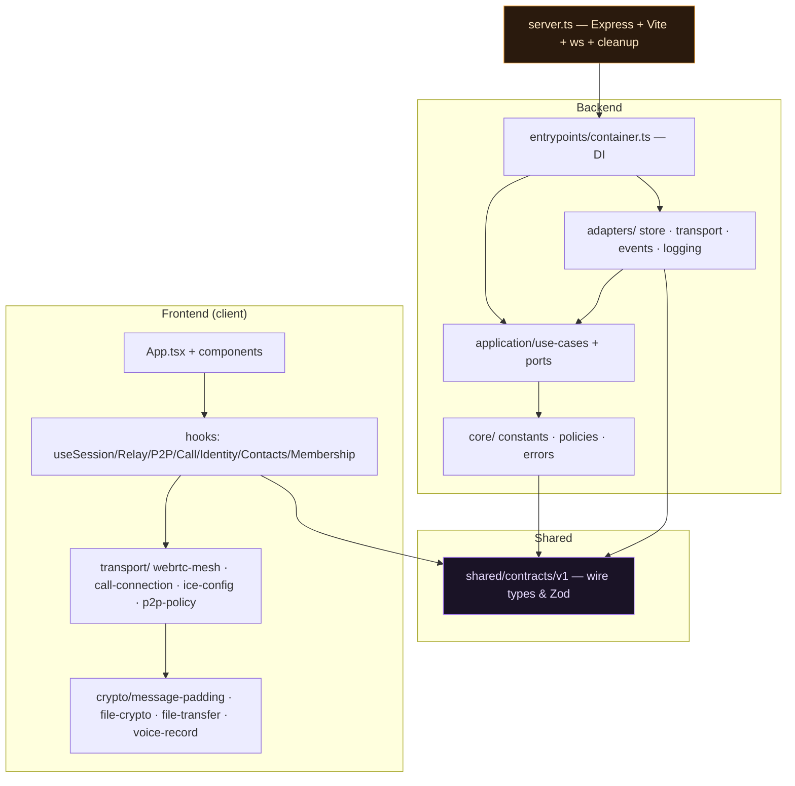

# Quantum Bunker — Architecture Diagrams

> Structural views of the system: deployment, hexagonal backend, frontend hook tree, the shared
> contract layer, and the data paths. Diagrams are [Mermaid](https://mermaid.js.org/) and render as
> images on GitHub and most Markdown viewers.

## Index

1. [System context](#1-system-context)
2. [Deployment topology](#2-deployment-topology)
3. [Hexagonal backend (ports & adapters)](#3-hexagonal-backend-ports--adapters)
4. [Dependency rule](#4-dependency-rule)
5. [Backend request data flow](#5-backend-request-data-flow)
6. [Frontend hook tree](#6-frontend-hook-tree)
7. [Shared contract layer](#7-shared-contract-layer)
8. [Transport stack (relay + P2P)](#8-transport-stack-relay--p2p)
9. [Event bus fan-out](#9-event-bus-fan-out)
10. [Client persistence model](#10-client-persistence-model)
11. [Module map](#11-module-map)

---

## 1. System context

Two or more browsers, one blind relay. All cryptographic meaning lives in the clients.

```mermaid
graph TB
    subgraph Clients
        A["Browser A — Host<br/>React 19 + hooks"]
        B["Browser B — Peer"]
        C["Browser C — Peer"]
    end

    R{{"Quantum Bunker Server<br/>Express + ws<br/><b>BLIND RELAY</b><br/>in-memory only"}}

    A -- "HTTPS REST + WSS" --> R
    B -- "WSS" --> R
    C -- "WSS" --> R

    A == "WebRTC data / media (direct, double-ratchet over DTLS)" === B
    A -. "STUN/TURN" .-> ICE[(STUN / TURN)]
    B -. .-> ICE

    style R fill:#0d2235,stroke:#00e5ff,color:#cdefff
    style A fill:#10261a,stroke:#2ecc71,color:#d6ffe0
```

> The server **never** decrypts, stores, or logs `envelope.payload`. P2P media bypasses it entirely.

---

## 2. Deployment topology

Single Node process, single port. Vite serves the frontend in dev; static assets in prod.



---

## 3. Hexagonal backend (ports & adapters)

Use cases depend only on port interfaces; adapters implement them; the container wires them.



---

## 4. Dependency rule

Imports flow inward only: `core → application → adapters → entrypoints`. Nothing flows upstream.



| Layer | May import | Must NOT import |
|---|---|---|
| `core/` | `shared/contracts/v1/` types only | application, adapters, entrypoints, Node built-ins |
| `application/` | `core/`, port interfaces | adapter implementations, Express, ws, Winston |
| `adapters/` | `application/`, `core/`, npm infra libs | entrypoints |
| `entrypoints/` | everything (composition root) | — |

---

## 5. Backend request data flow

Every state mutation passes through a use case — the WS adapter never touches store state directly.



---

## 6. Frontend hook tree

Components stay declarative; hooks own all side effects and state.



---

## 7. Shared contract layer

`src/shared/contracts/v1/` is the single source of truth shared by client and server.



> Fields are **add-only**. Removing/renaming a field is breaking and requires a `v2/` directory.

---

## 8. Transport stack (relay + P2P)

WebRTC is layered *on top of* the relay, never replacing it.



> The relay is the fallback for **coordination**, never for **media**. On `directFailed`, the UI
> surfaces the failure — it does not silently reroute media through the relay.

---

## 9. Event bus fan-out

Use cases emit typed events; infrastructure subscribes. No use case imports a logger directly.



---

## 10. Client persistence model

Where each piece of state lives, and what survives a refresh vs. tab close.



> Never a database, Redis, or file. Ephemerality is the design (see ADR-001/002).

---

## 11. Module map

High-level file responsibilities across the monorepo.



---

*See also: [`workflows.md`](workflows.md) for runtime sequences and
[`../design-document.md`](../design-document.md) for the full design rationale.*
