# Quantum Bunker — Workflow Diagrams

> Visual reference for every runtime flow in Quantum Bunker. Diagrams are written in
> [Mermaid](https://mermaid.js.org/) and render automatically as images on GitHub, in VS Code
> (with the Markdown Preview Mermaid extension), and in most modern Markdown viewers.
>
> **Legend** — `Server` is always a *blind relay*: it routes opaque envelopes and never decrypts,
> stores, or logs `envelope.payload`. Solid arrows are relayed/HTTP traffic; double lines are direct
> peer-to-peer (WebRTC) media or data that never touches the relay.

## Index

1. [Lifecycle overview](#1-lifecycle-overview)
2. [Session creation](#2-session-creation)
3. [Join — standard approval](#3-join--standard-approval)
4. [Join — stateless whitelist (auto-admit)](#4-join--stateless-whitelist-auto-admit)
5. [Join — rejected / limits hit](#5-join--rejected--limits-hit)
6. [Authentication precedence on `join`](#6-authentication-precedence-on-join)
7. [Reconnect after refresh](#7-reconnect-after-refresh)
8. [Messaging — relay, ACK, read receipt](#8-messaging--relay-ack-read-receipt)
9. [Edit & delete](#9-edit--delete)
10. [Envelope rejection & rate limiting](#10-envelope-rejection--rate-limiting)
11. [P2P connection setup (WebRTC)](#11-p2p-connection-setup-webrtc)
12. [File transfer — relay path (≤ 5 MB)](#12-file-transfer--relay-path--5-mb)
13. [File transfer — P2P path (≤ 256 MB)](#13-file-transfer--p2p-path--256-mb)
14. [Voice / video call (1-on-1)](#14-voice--video-call-1-on-1)
15. [In-chat mutual whitelist](#15-in-chat-mutual-whitelist)
16. [Contact verification & key-change alert](#16-contact-verification--key-change-alert)
17. [Session destruction & auto-cleanup](#17-session-destruction--auto-cleanup)

---

## 1. Lifecycle overview

The end-to-end state of a vault, from creation to destruction.

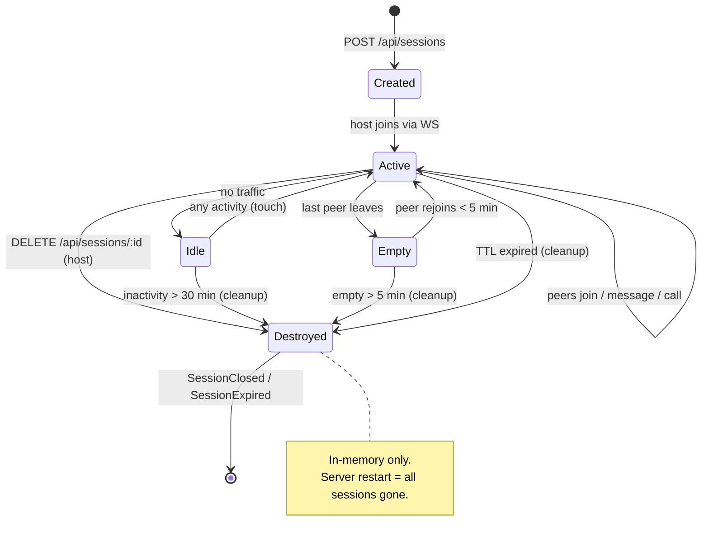
```mermaid
stateDiagram-v2
    [*] --> Created: POST /api/sessions
    Created --> Active: host joins via WS
    Active --> Active: peers join / message / call
    Active --> Idle: no traffic
    Idle --> Active: any activity (touch)
    Active --> Empty: last peer leaves
    Empty --> Active: peer rejoins < 5 min

    Active --> Destroyed: DELETE /api/sessions/:id (host)
    Idle --> Destroyed: inactivity > 30 min (cleanup)
    Empty --> Destroyed: empty > 5 min (cleanup)
    Active --> Destroyed: TTL expired (cleanup)

    Destroyed --> [*]: SessionClosed / SessionExpired

    note right of Destroyed
        In-memory only.
        Server restart = all sessions gone.
    end note
```

---

## 2. Session creation

Host creates a vault over REST, then claims host authority over WebSocket.

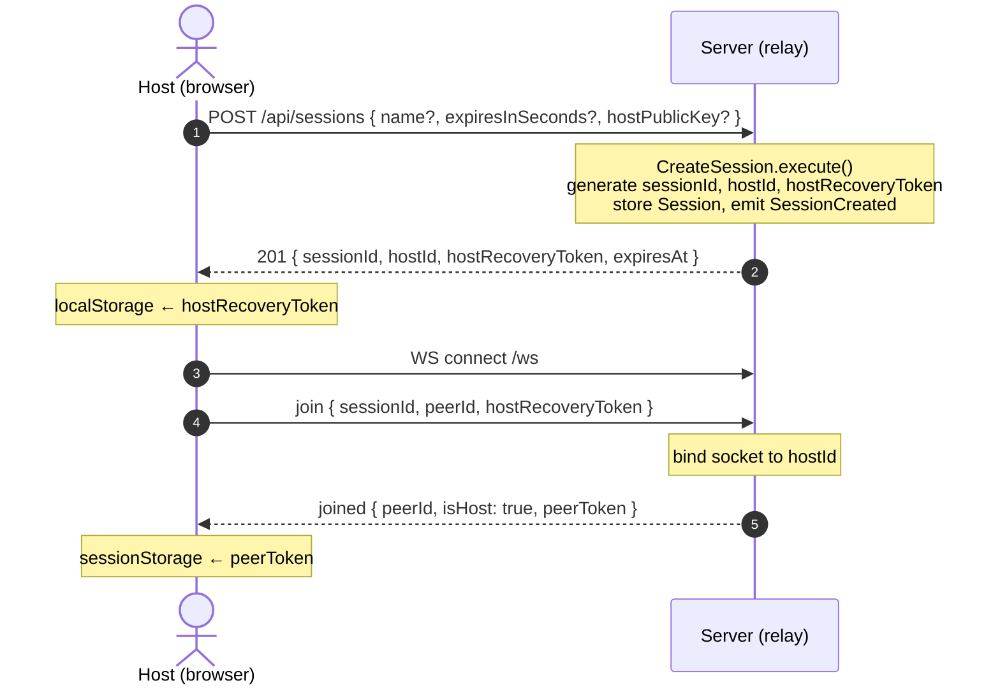
```mermaid
sequenceDiagram
    autonumber
    actor A as Host (browser)
    participant S as Server (relay)

    A->>S: POST /api/sessions { name?, expiresInSeconds?, hostPublicKey? }
    Note over S: CreateSession.execute()<br/>generate sessionId, hostId, hostRecoveryToken<br/>store Session, emit SessionCreated
    S-->>A: 201 { sessionId, hostId, hostRecoveryToken, expiresAt }

    Note over A: localStorage ← hostRecoveryToken

    A->>S: WS connect /ws
    A->>S: join { sessionId, peerId, hostRecoveryToken }
    Note over S: bind socket to hostId
    S-->>A: joined { peerId, isHost: true, peerToken }
    Note over A: sessionStorage ← peerToken
```

> `hostPublicKey` is optional — supplying it enables the stateless whitelist (flow #4).

---

## 3. Join — standard approval

A guest with no token waits in the pending queue until the host accepts.

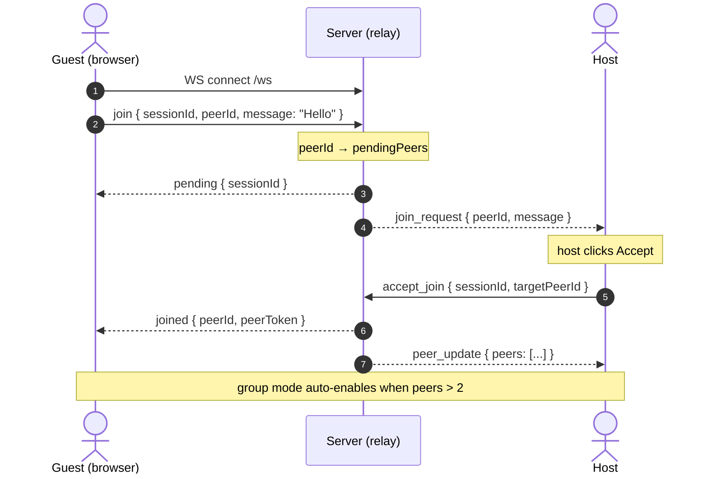
```mermaid
sequenceDiagram
    autonumber
    actor B as Guest (browser)
    participant S as Server (relay)
    actor A as Host

    B->>S: WS connect /ws
    B->>S: join { sessionId, peerId, message: "Hello" }
    Note over S: peerId → pendingPeers
    S-->>B: pending { sessionId }
    S-->>A: join_request { peerId, message }

    Note over A: host clicks Accept
    A->>S: accept_join { sessionId, targetPeerId }
    S-->>B: joined { peerId, peerToken }
    S-->>A: peer_update { peers: [...] }
    Note over A,B: group mode auto-enables when peers > 2
```

---

## 4. Join — stateless whitelist (auto-admit)

A member presenting a valid host-signed token is admitted with **no host interaction**.

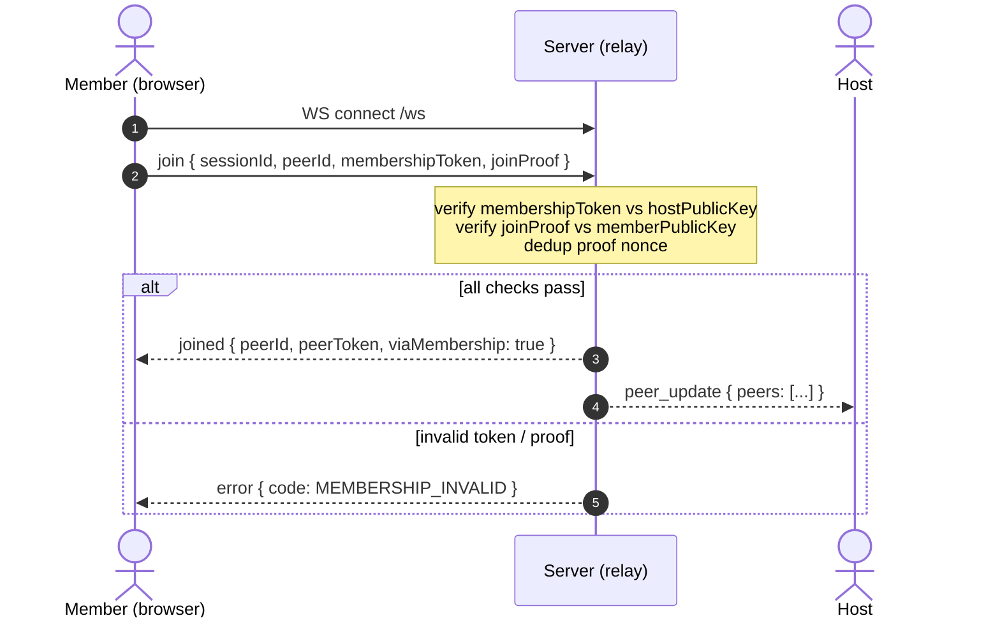
```mermaid
sequenceDiagram
    autonumber
    actor B as Member (browser)
    participant S as Server (relay)
    actor A as Host

    B->>S: WS connect /ws
    B->>S: join { sessionId, peerId, membershipToken, joinProof }
    Note over S: verify membershipToken vs hostPublicKey<br/>verify joinProof vs memberPublicKey<br/>dedup proof nonce
    alt all checks pass
        S-->>B: joined { peerId, peerToken, viaMembership: true }
        S-->>A: peer_update { peers: [...] }
    else invalid token / proof
        S-->>B: error { code: MEMBERSHIP_INVALID }
    end
```

---

## 5. Join — rejected / limits hit

All the ways a join can fail.

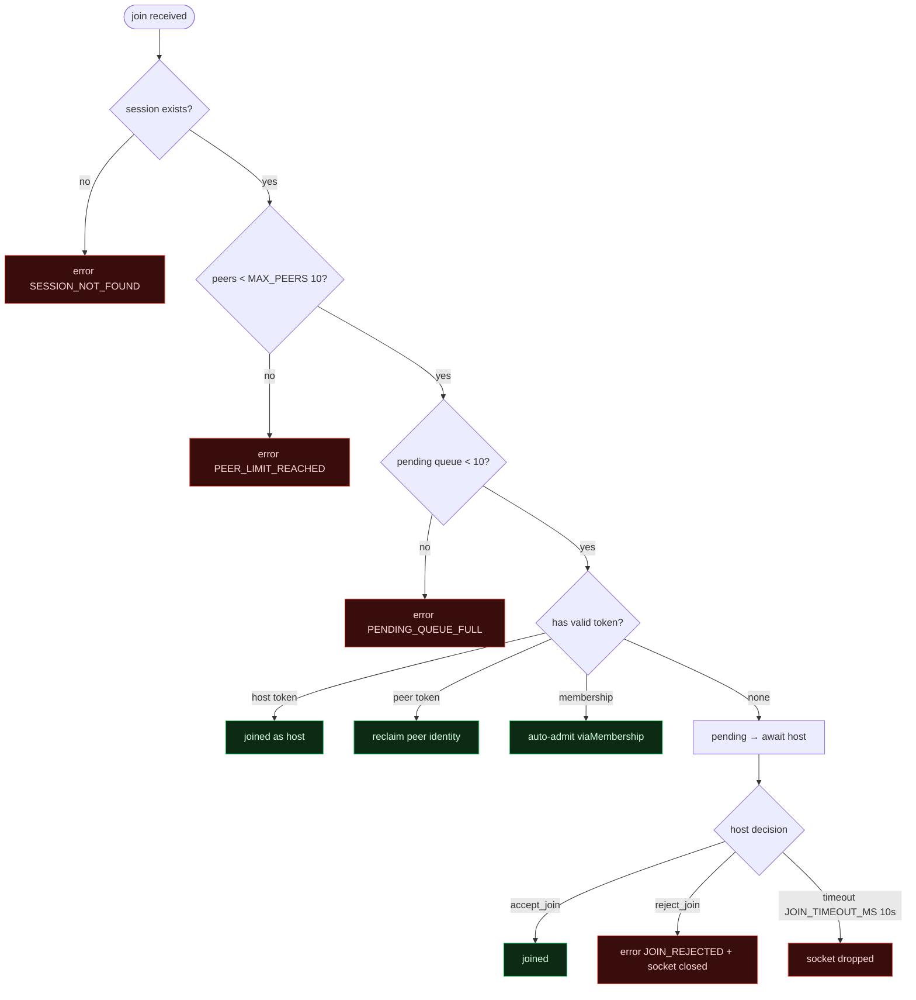
```mermaid
flowchart TD
    J([join received]) --> SESS{session exists?}
    SESS -- no --> E1[error SESSION_NOT_FOUND]
    SESS -- yes --> CAP{peers &lt; MAX_PEERS 10?}
    CAP -- no --> E2[error PEER_LIMIT_REACHED]
    CAP -- yes --> PQ{pending queue &lt; 10?}
    PQ -- no --> E3[error PENDING_QUEUE_FULL]
    PQ -- yes --> AUTH{has valid token?}
    AUTH -- host token --> H[joined as host]
    AUTH -- peer token --> R[reclaim peer identity]
    AUTH -- membership --> M[auto-admit viaMembership]
    AUTH -- none --> P[pending → await host]
    P --> HD{host decision}
    HD -- accept_join --> OK[joined]
    HD -- reject_join --> E4[error JOIN_REJECTED + socket closed]
    HD -- timeout JOIN_TIMEOUT_MS 10s --> E5[socket dropped]

    classDef err fill:#3a0d0d,stroke:#e74c3c,color:#ffd9d9;
    classDef ok fill:#0d2a14,stroke:#2ecc71,color:#d6ffe0;
    class E1,E2,E3,E4,E5 err;
    class H,R,M,OK ok;
```

---

## 6. Authentication precedence on `join`

The server resolves identity in strict order — first match wins.

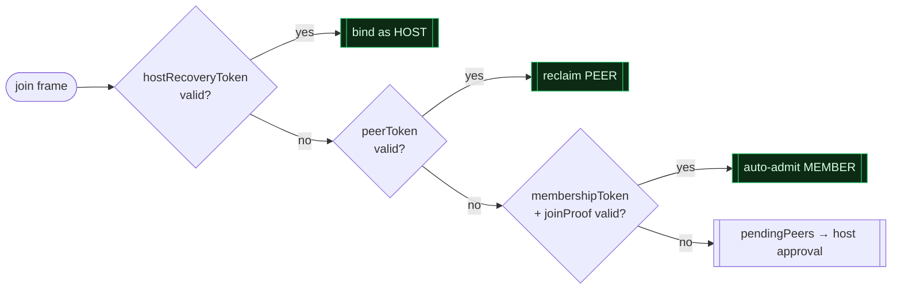
```mermaid
flowchart LR
    IN([join frame]) --> T1{hostRecoveryToken<br/>valid?}
    T1 -- yes --> HOST[[bind as HOST]]
    T1 -- no --> T2{peerToken<br/>valid?}
    T2 -- yes --> PEER[[reclaim PEER]]
    T2 -- no --> T3{membershipToken<br/>+ joinProof valid?}
    T3 -- yes --> MEMBER[[auto-admit MEMBER]]
    T3 -- no --> PEND[[pendingPeers → host approval]]

    classDef ok fill:#0d2a14,stroke:#2ecc71,color:#d6ffe0;
    class HOST,PEER,MEMBER ok;
```

---

## 7. Reconnect after refresh

Identity survives a page refresh inside the 30-second grace window.

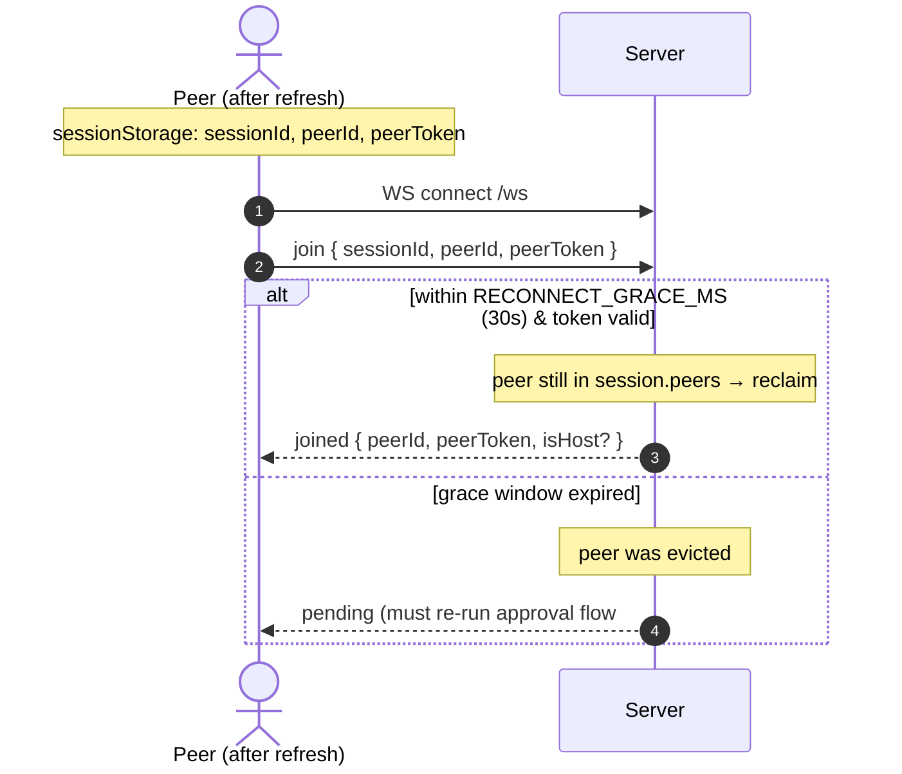
```mermaid
sequenceDiagram
    autonumber
    actor P as Peer (after refresh)
    participant S as Server

    Note over P: sessionStorage: sessionId, peerId, peerToken
    P->>S: WS connect /ws
    P->>S: join { sessionId, peerId, peerToken }
    alt within RECONNECT_GRACE_MS (30s) & token valid
        Note over S: peer still in session.peers → reclaim
        S-->>P: joined { peerId, peerToken, isHost? }
    else grace window expired
        Note over S: peer was evicted
        S-->>P: pending  (must re-run approval flow #3)
    end
```

---

## 8. Messaging — relay, ACK, read receipt

The core fan-out path, including sender ACK and recipient read receipt.

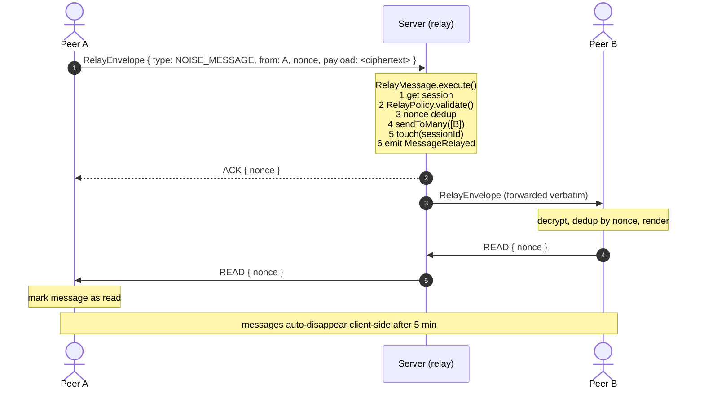
```mermaid
sequenceDiagram
    autonumber
    actor A as Peer A
    participant S as Server (relay)
    actor B as Peer B

    A->>S: RelayEnvelope { type: NOISE_MESSAGE, from: A, nonce, payload: <ciphertext> }
    Note over S: RelayMessage.execute()<br/>1 get session<br/>2 RelayPolicy.validate()<br/>3 nonce dedup<br/>4 sendToMany([B])<br/>5 touch(sessionId)<br/>6 emit MessageRelayed
    S-->>A: ACK { nonce }
    S->>B: RelayEnvelope (forwarded verbatim)
    Note over B: decrypt, dedup by nonce, render
    B->>S: READ { nonce }
    S->>A: READ { nonce }
    Note over A: mark message as read
    Note over A,B: messages auto-disappear client-side after 5 min
```

---

## 9. Edit & delete

Author-bound mutations applied client-side; the relay stays blind.

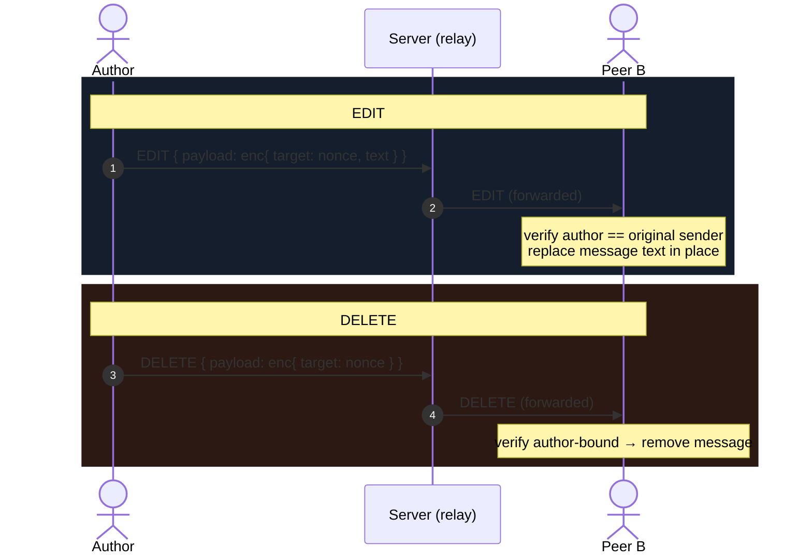
```mermaid
sequenceDiagram
    autonumber
    actor A as Author
    participant S as Server (relay)
    actor B as Peer B

    rect rgb(20,30,45)
    Note over A,B: EDIT
    A->>S: EDIT { payload: enc{ target: nonce, text } }
    S->>B: EDIT (forwarded)
    Note over B: verify author == original sender<br/>replace message text in place
    end

    rect rgb(45,25,20)
    Note over A,B: DELETE
    A->>S: DELETE { payload: enc{ target: nonce } }
    S->>B: DELETE (forwarded)
    Note over B: verify author-bound → remove message
    end
```

---

## 10. Envelope rejection & rate limiting

Validation, replay, and rate-limit guards before fan-out.

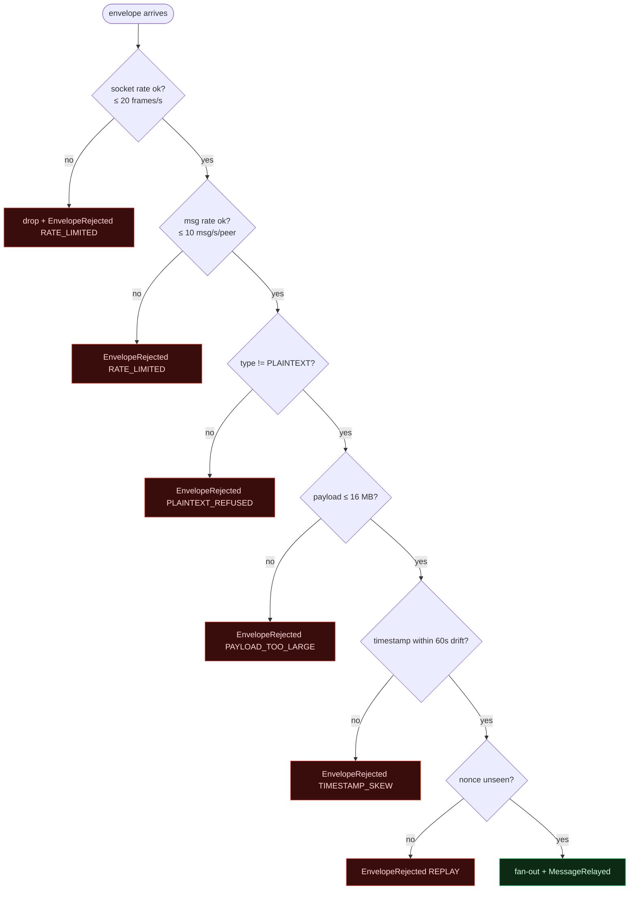
```mermaid
flowchart TD
    E([envelope arrives]) --> RL{socket rate ok?<br/>≤ 20 frames/s}
    RL -- no --> X1[drop + EnvelopeRejected RATE_LIMITED]
    RL -- yes --> MR{msg rate ok?<br/>≤ 10 msg/s/peer}
    MR -- no --> X2[EnvelopeRejected RATE_LIMITED]
    MR -- yes --> PT{type != PLAINTEXT?}
    PT -- no --> X3[EnvelopeRejected PLAINTEXT_REFUSED]
    PT -- yes --> SZ{payload ≤ 16 MB?}
    SZ -- no --> X4[EnvelopeRejected PAYLOAD_TOO_LARGE]
    SZ -- yes --> TS{timestamp within 60s drift?}
    TS -- no --> X5[EnvelopeRejected TIMESTAMP_SKEW]
    TS -- yes --> NC{nonce unseen?}
    NC -- no --> X6[EnvelopeRejected REPLAY]
    NC -- yes --> OK[fan-out + MessageRelayed]

    classDef err fill:#3a0d0d,stroke:#e74c3c,color:#ffd9d9;
    classDef ok fill:#0d2a14,stroke:#2ecc71,color:#d6ffe0;
    class X1,X2,X3,X4,X5,X6 err;
    class OK ok;
```

> Every rejection emits an `EnvelopeRejected` event with `rawEnvelope.payload` redacted.

---

## 11. P2P connection setup (WebRTC)

Signaling is relayed as opaque `SIGNALING` envelopes; the data channel is direct.

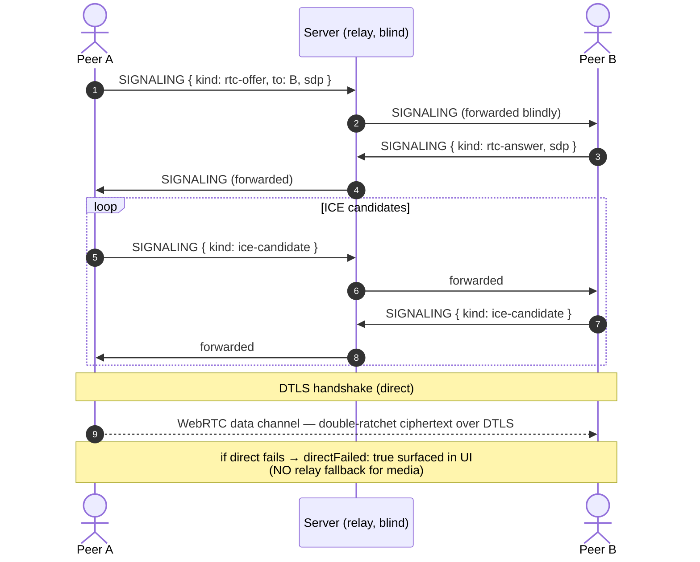
```mermaid
sequenceDiagram
    autonumber
    actor A as Peer A
    participant S as Server (relay, blind)
    actor B as Peer B

    A->>S: SIGNALING { kind: rtc-offer, to: B, sdp }
    S->>B: SIGNALING (forwarded blindly)
    B->>S: SIGNALING { kind: rtc-answer, sdp }
    S->>A: SIGNALING (forwarded)
    loop ICE candidates
        A->>S: SIGNALING { kind: ice-candidate }
        S->>B: forwarded
        B->>S: SIGNALING { kind: ice-candidate }
        S->>A: forwarded
    end
    Note over A,B: DTLS handshake (direct)
    A-->>B: WebRTC data channel — double-ratchet ciphertext over DTLS
    Note over A,B: if direct fails → directFailed: true surfaced in UI<br/>(NO relay fallback for media)
```

---

## 12. File transfer — relay path (≤ 5 MB)

Small files travel as a `FILE` envelope through the blind relay.

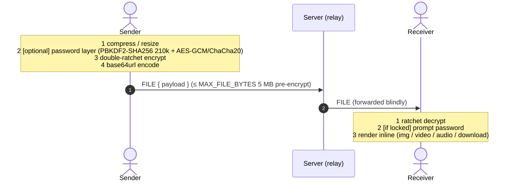
```mermaid
sequenceDiagram
    autonumber
    actor A as Sender
    participant S as Server (relay)
    actor B as Receiver

    Note over A: 1 compress / resize<br/>2 [optional] password layer (PBKDF2-SHA256 210k + AES-GCM/ChaCha20)<br/>3 double-ratchet encrypt<br/>4 base64url encode
    A->>S: FILE { payload } (≤ MAX_FILE_BYTES 5 MB pre-encrypt)
    S->>B: FILE (forwarded blindly)
    Note over B: 1 ratchet decrypt<br/>2 [if locked] prompt password<br/>3 render inline (img / video / audio / download)
```

> `sendFile` refuses to relay unless the E2E channel manager exists — **no plaintext fallback**.

---

## 13. File transfer — P2P path (≤ 256 MB)

Large files stream over the WebRTC data channel and bypass the relay entirely.

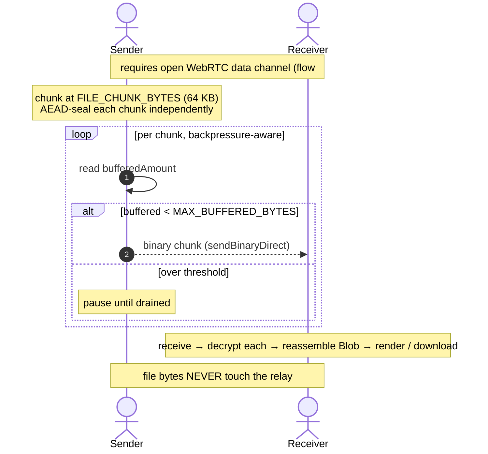
```mermaid
sequenceDiagram
    autonumber
    actor A as Sender
    actor B as Receiver

    Note over A,B: requires open WebRTC data channel (flow #11)
    Note over A: chunk at FILE_CHUNK_BYTES (64 KB)<br/>AEAD-seal each chunk independently
    loop per chunk, backpressure-aware
        A->>A: read bufferedAmount
        alt buffered < MAX_BUFFERED_BYTES
            A-->>B: binary chunk (sendBinaryDirect)
        else over threshold
            Note over A: pause until drained
        end
    end
    Note over B: receive → decrypt each → reassemble Blob → render / download
    Note over A,B: file bytes NEVER touch the relay
```

---

## 14. Voice / video call (1-on-1)

Only offered when exactly one other peer is present. Media is DTLS-SRTP, never relayed.

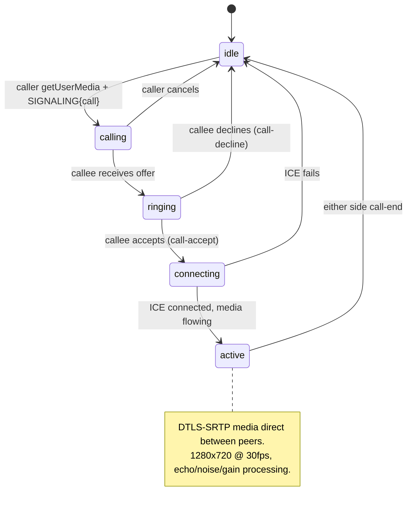
```mermaid
stateDiagram-v2
    [*] --> idle
    idle --> calling: caller getUserMedia + SIGNALING{call}
    calling --> ringing: callee receives offer
    ringing --> connecting: callee accepts (call-accept)
    ringing --> idle: callee declines (call-decline)
    connecting --> active: ICE connected, media flowing
    active --> idle: either side call-end
    calling --> idle: caller cancels
    connecting --> idle: ICE fails

    note right of active
        DTLS-SRTP media direct between peers.
        1280x720 @ 30fps, echo/noise/gain processing.
    end note
```

Call signaling sequence:

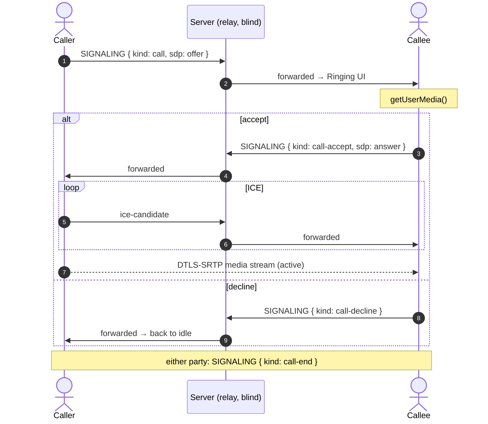
```mermaid
sequenceDiagram
    autonumber
    actor C as Caller
    participant S as Server (relay, blind)
    actor E as Callee

    C->>S: SIGNALING { kind: call, sdp: offer }
    S->>E: forwarded → Ringing UI
    Note over E: getUserMedia()
    alt accept
        E->>S: SIGNALING { kind: call-accept, sdp: answer }
        S->>C: forwarded
        loop ICE
            C->>S: ice-candidate
            S->>E: forwarded
        end
        C-->>E: DTLS-SRTP media stream (active)
    else decline
        E->>S: SIGNALING { kind: call-decline }
        S->>C: forwarded → back to idle
    end
    Note over C,E: either party: SIGNALING { kind: call-end }
```

---

## 15. In-chat mutual whitelist

Peers exchange identity keys in-band; trust is mutual only when **both** pin the other.

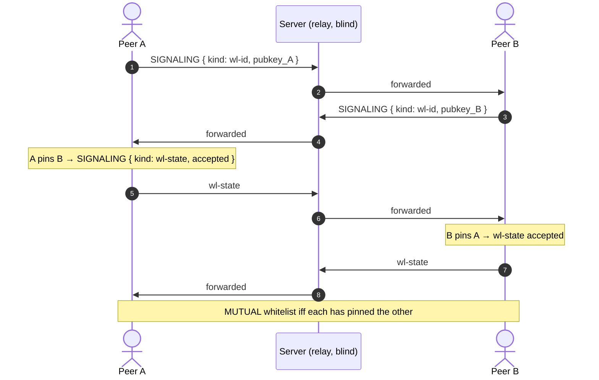
```mermaid
sequenceDiagram
    autonumber
    actor A as Peer A
    participant S as Server (relay, blind)
    actor B as Peer B

    A->>S: SIGNALING { kind: wl-id, pubkey_A }
    S->>B: forwarded
    B->>S: SIGNALING { kind: wl-id, pubkey_B }
    S->>A: forwarded
    Note over A: A pins B → SIGNALING { kind: wl-state, accepted }
    A->>S: wl-state
    S->>B: forwarded
    Note over B: B pins A → wl-state accepted
    B->>S: wl-state
    S->>A: forwarded
    Note over A,B: MUTUAL whitelist iff each has pinned the other
```

---

## 16. Contact verification & key-change alert

Safety-number comparison detects MITM; a key change hard-blocks messaging.

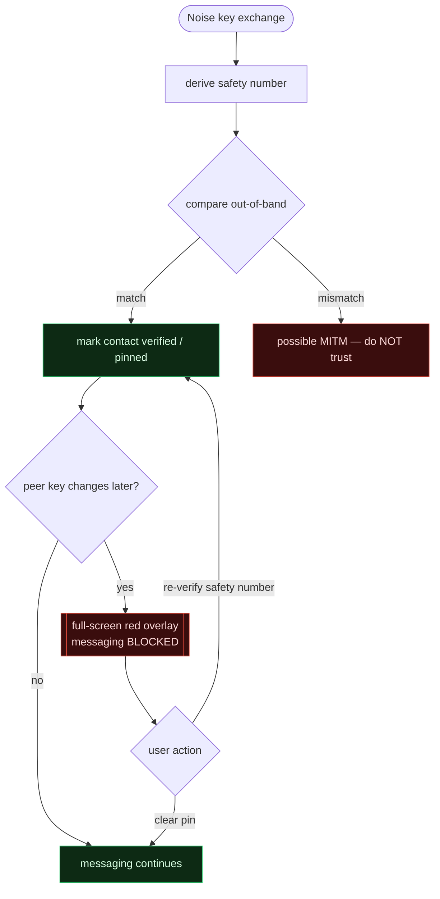
```mermaid
flowchart TD
    HS([Noise key exchange]) --> SN[derive safety number]
    SN --> CMP{compare out-of-band}
    CMP -- match --> V[mark contact verified / pinned]
    CMP -- mismatch --> MITM[possible MITM — do NOT trust]

    V --> WATCH{peer key changes later?}
    WATCH -- no --> OK[messaging continues]
    WATCH -- yes --> ALERT[[full-screen red overlay<br/>messaging BLOCKED]]
    ALERT --> ACT{user action}
    ACT -- re-verify safety number --> V
    ACT -- clear pin --> OK

    classDef warn fill:#3a0d0d,stroke:#e74c3c,color:#ffd9d9;
    classDef ok fill:#0d2a14,stroke:#2ecc71,color:#d6ffe0;
    class MITM,ALERT warn;
    class V,OK ok;
```

---

## 17. Session destruction & auto-cleanup

Host-initiated teardown vs. the 60-second cleanup sweep.

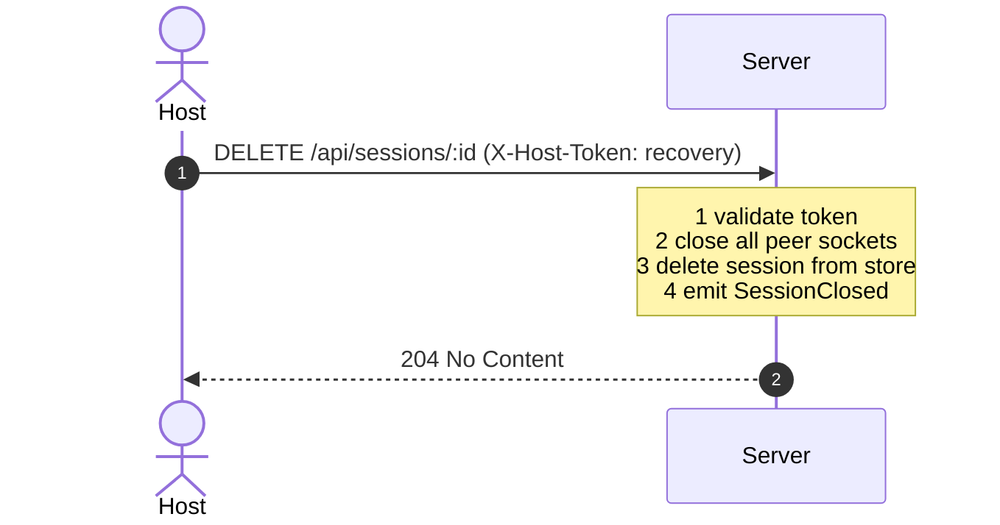
```mermaid
sequenceDiagram
    autonumber
    actor A as Host
    participant S as Server

    A->>S: DELETE /api/sessions/:id (X-Host-Token: recovery)
    Note over S: 1 validate token<br/>2 close all peer sockets<br/>3 delete session from store<br/>4 emit SessionClosed
    S-->>A: 204 No Content
```

Automatic cleanup (`CleanupSessions`, every `CLEANUP_INTERVAL_MS` = 60s):

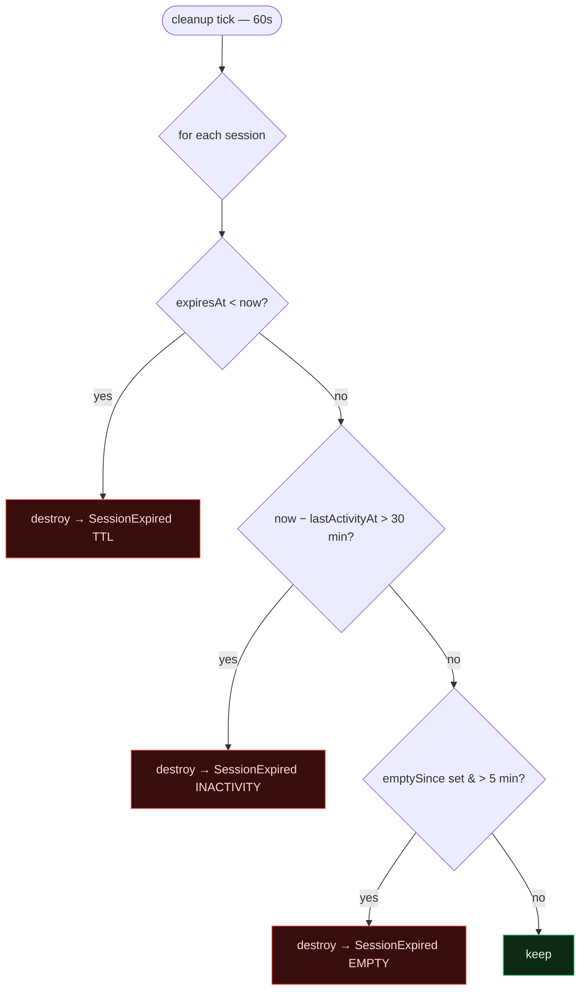
```mermaid
flowchart TD
    T([cleanup tick — 60s]) --> L{for each session}
    L --> C1{expiresAt &lt; now?}
    C1 -- yes --> K[destroy → SessionExpired TTL]
    C1 -- no --> C2{now − lastActivityAt &gt; 30 min?}
    C2 -- yes --> K2[destroy → SessionExpired INACTIVITY]
    C2 -- no --> C3{emptySince set &amp; &gt; 5 min?}
    C3 -- yes --> K3[destroy → SessionExpired EMPTY]
    C3 -- no --> KEEP[keep]

    classDef err fill:#3a0d0d,stroke:#e74c3c,color:#ffd9d9;
    classDef ok fill:#0d2a14,stroke:#2ecc71,color:#d6ffe0;
    class K,K2,K3 err;
    class KEEP ok;
```

---

*See also: [`architecture.md`](architecture.md) for structural diagrams and
[`../design-document.md`](../design-document.md) for the full design rationale.*
